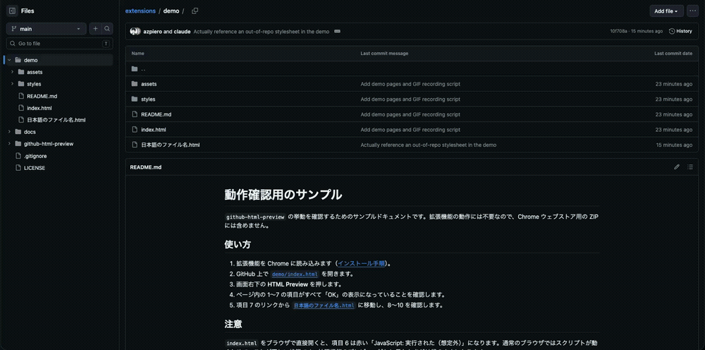

# GitHub HTML Preview

GitHub上の `.html` / `.htm` ファイルを、CSSと画像つきで読むためのChrome拡張です。ビルドやサーバーの準備は不要です。

## デモ

実際に試せるサンプルを [`demo/`](demo/) に置いてあります。GitHub上で [`demo/index.html`](demo/index.html) を開き、右下の **HTML Preview** を押すと、CSSの読み込み・`@import`の展開・画像の表示・JavaScriptが実行されないことを一度に確認できます。

## 類似の拡張機能との違い

同じ目的の拡張機能はいくつか存在します。この拡張の立ち位置は **「JavaScriptを有効にせずに、CSSと画像だけを表示する」** ことです。

- 相対パスのCSS・画像・フォントを `data:` URIとして埋め込んで表示します。スクリプトを有効化するモードはありません。
- CSSの `@import` の展開、CSS内 `url(...)` の解決に対応しています。
- 別のHTMLへの相対リンクは、対応するGitHubのファイルページに置き換えます。
- 非公開リポジトリはブラウザの既存セッションを利用します。アクセストークンの入力・保存はありません。

JavaScriptを動かしてプレビューしたい場合や、外部CDNのCSSを読み込みたい場合は、他の拡張機能かGitHub Pagesの方が適しています。

## インストール

1. このリポジトリを `git clone` するか、ZIPをダウンロードして展開します。
2. Chromeのアドレス欄に `chrome://extensions` と入力します。
3. 右上の「デベロッパー モード」をオンにします。
4. 「パッケージ化されていない拡張機能を読み込む」を押します。
5. `manifest.json` が入ったフォルダ（clone・展開したリポジトリのルート）を選びます。
6. 開いていたGitHubのページを再読み込みします。

ZIPファイル自体ではなく、展開したフォルダを選んでください。インストール後もそのフォルダは保存しておいてください。

## 使い方

GitHubでHTMLファイルを開き、画面右下の **HTML Preview** を押します。プレビューの左上にある **Codeに戻る** で元の画面に戻れます。別のタブで読みたい場合は **別タブで開く** を使えます。

例: `notes/VMと開発コンテナ.html` が `../styles/theme.css` を参照していれば、同じリポジトリのCSSを取得して適用します。

## 対応する内容

- HTML本文と、HTML内に記述したCSS。
- 同じリポジトリ内の相対パスで参照したCSS・画像・フォント。
- 通常のCSS `@import`、CSSの `url(...)` で参照する画像。
- 日本語を含むファイル名。
- ページ内リンク。別のHTMLへの相対リンクは、対応するGitHubのファイルを別タブで開きます。
- GitHub内でファイルを移動した場合のプレビューボタンの更新。

元のHTML内のJavaScriptは実行しません。フォーム送信、埋め込みiframe、動画再生にも対応していません。

## 非公開リポジトリ

ChromeのGitHubログインを利用してRawファイルの取得を試みます。トークンの入力や保存はありません。GitHubで閲覧できること、対象ファイルのRawが開けることが前提です。

実際の非公開リポジトリでの動作は未確認です。GitHubや組織の認証設定によって取得できない場合は、プレビューにエラーを表示します。

## 初版の制約

- GitHub.com専用です。GitHub Enterpriseの独自ドメインには未対応です。
- CDN、Google Fontsなど、同じリポジトリ以外にあるCSS・画像・フォントは読み込みません。
- `/assets/...` のようなサイトルートからのパスではなく、`../assets/...` のようなファイル基準の相対パスを使用してください。
- `srcset` による画像の切り替え、外部SVGの `use`、`layer()` / `supports()` つきのCSS importなどは未対応です。
- 1ファイル15MB、合計50MB、関連ファイル最大200件を目安に上限があります。
- UTF-8のHTML・CSSを対象にしています。

## データの扱い

アクセス権限は `github.com` と `raw.githubusercontent.com` のみです。同じリポジトリ内のファイルを取得し、端末内で表示します。解析サービスや第三者のプレビューサービスへの送信、アクセス解析、ファイルの永続保存は行いません。リンクをクリックすると、そのリンク先を通常のブラウザタブで開きます。

プレビューはsandbox付きiframeに表示し、CSPでもスクリプト実行を禁止しています。

## 検証状況

Chromeに読み込み、[`demo/`](demo/) のサンプルで描画を確認しています。相対パスの外部CSS、`@import` の展開、CSS `url()` の背景画像、`` の相対パス、インライン `style` 属性、日本語ファイル名、HTML内のJavaScriptが実行されないことを確認ずみです。

非公開リポジトリでの取得は未検証です。

## うまく動かないとき

**プレビューに「ページを再読み込みしてください」と出る / Chromeのエラー画面になる**

`chrome://extensions` で拡張機能を読み込み・再読み込みしたあと、開いていたGitHubのタブを再読み込みしていない状態です。拡張機能を入れ替えると、それ以前に開いていたタブのスクリプトは古いままになります。GitHubのページを再読み込みしてください。

**プレビュー上部に「一部の装飾・画像を読み込めませんでした」と出る**

同じリポジトリの外にあるCSSや画像、サイトルートからのパス（`/assets/...`）は読み込みません。ファイル基準の相対パス（`../assets/...`）に直してください。本文の表示は続行されます。

## 更新・削除

更新するときはフォルダの内容を置き換え、`chrome://extensions` のこの拡張の更新ボタンを押してからGitHubを再読み込みします。削除するときは同じ画面の「削除」を押します。

## ライセンス

MIT License. 詳細は [LICENSE](LICENSE) を参照してください。
